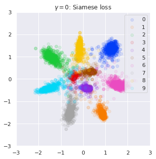
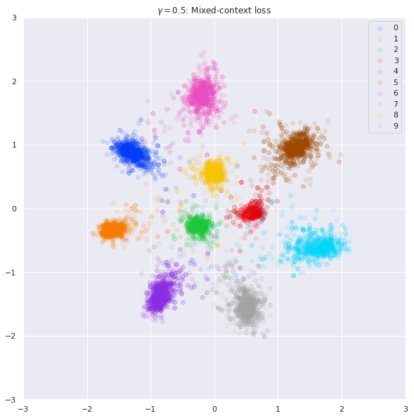
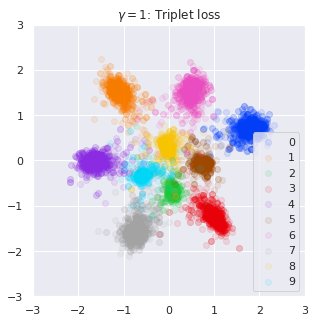

# PyTorch implementation of Scale-Aware Triplet Networks
This repository contains code for **Scale-Aware Triplet Networks** based on [Learning Deep Descriptors with Scale-Aware Triplet Networks](http://openaccess.thecvf.com/content_cvpr_2018/papers/Keller_Learning_Deep_Descriptors_CVPR_2018_paper.pdf) implemented in PyTorch.

## Requirements
- Python 3.6
- PyTorch 1.0

## Usage
Args:
- theta_glo (float, default: 1.15): Global context in all triplets.
- delta (int, default: 5): Scale correction parameter.
- gamma (float, default: 0.5): Ratio of siamese and triplet.
- scale_aware (bool, default: True): Scale-aware sampling.

Input:
- y_a: Anchor samples.
- y_b: Positive samples. Each positive samples have same class labels to the correspond anchor samples.
- targets: Class labels of y_a and y_b.

```python
criterion = MixedContextLoss(theta_glo=1.15, delta=5, gamma=0.5, scale_aware=True)

y_a = model(input1)
y_p = model(input2)

loss = criterion(y_a, y_p, targets)

optimizer.zero_grad()
loss.backward()
optimizer.step()
```

## Training
### MNIST
Use scale-aware siamese loss:
```
python train.py --gamma 0 --scale-aware True
```
Use scale-aware triplet loss:
```
python train.py --gamma 1 --scale-aware True
```
Use scale-aware mixed context loss (gamma=0.5):
```
python train.py --gamma 0.5 --scale-aware True
```

## Results
### MNIST



